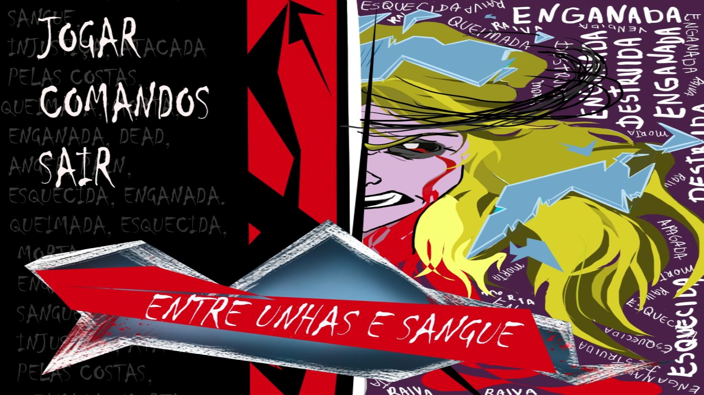
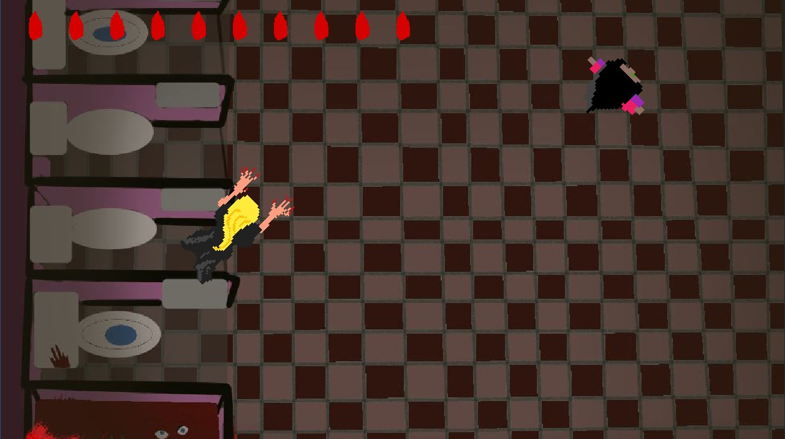
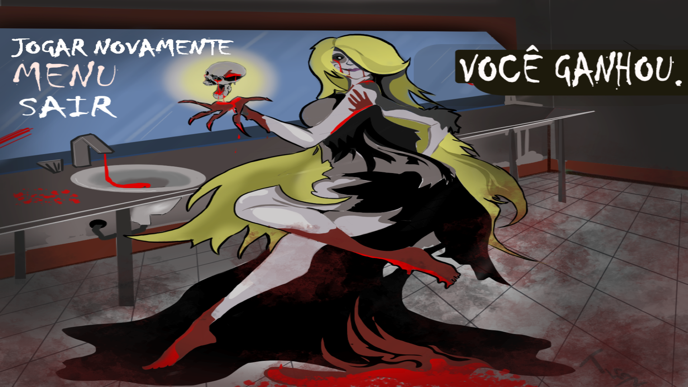
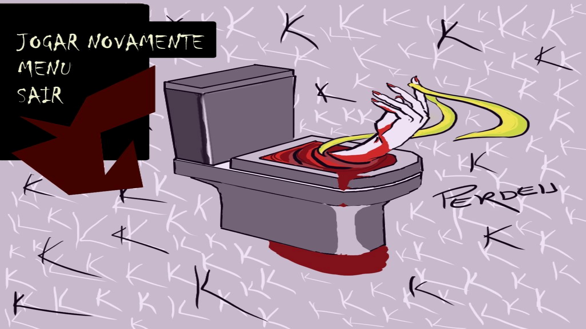

# Entre Unhas e Sangue

## Sumário
- [Entre Unhas e Sangue](#entre-unhas-e-sangue)
    - [Sumário](#sumário)
    - [1. Descrição](#1-descrição)
    - [2. Informações Gerais](#2-informações-gerais)
        - [2.1 História](#21-história)
        - [2.2 Screenshots](#22-screenshots)
        - [2.3 Itch.io](#23-itchio)
    - [3. Gameplay](#3-gameplay)
        - [3.1 Objetivo](#31-objetivo)
        - [3.2 Controles](#32-controles)      
--------------------------------

## 1. Descrição

***Entre Unhas e Sangue*** é um jogo no estilo top-down no qual você controla a loira do banheiro. O jogo foi desenvolvido para a [GameJam+ 2020](https://itch.io/jam/gamejam-2020) cuja o tema era Lendas Urbanas Locais.

## 2. Informações Gerais
### 2.1 História

A história do jogo se passa dentro do banheiro onde estudantes de uma escola invocaram a famosa loira do banheiro, agora ela quer sangue.

### 2.2 Screenshots

[TL;DR Go to Itch.io](#23-itchio)

Menu Inicial

Tela do Jogo

Tela de Vitória

Tela de Derrota

### 2.3 Itch.io

Link do jogo no ithc.io: https://jpbusche.itch.io/entre-unhas-e-sangue

## 3. Gameplay
### 3.1 Objetivo

O objetivo do jogo é matar todos os estudantes do banheiro, mas sem ser vista.

### 3.2 Controles

Os controles do jogo são:

| Controle | Descrição |
| --- | --- |
| WSAD | Movimentação |
| Space | Ataque |
